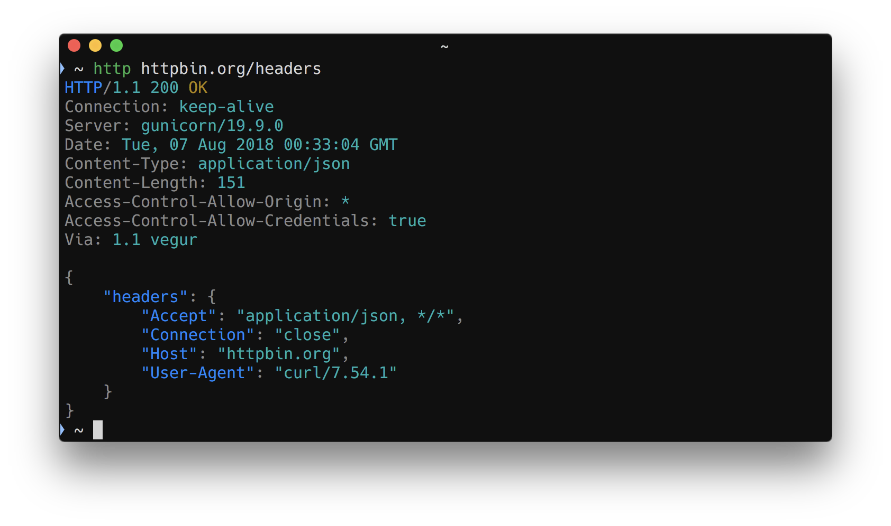
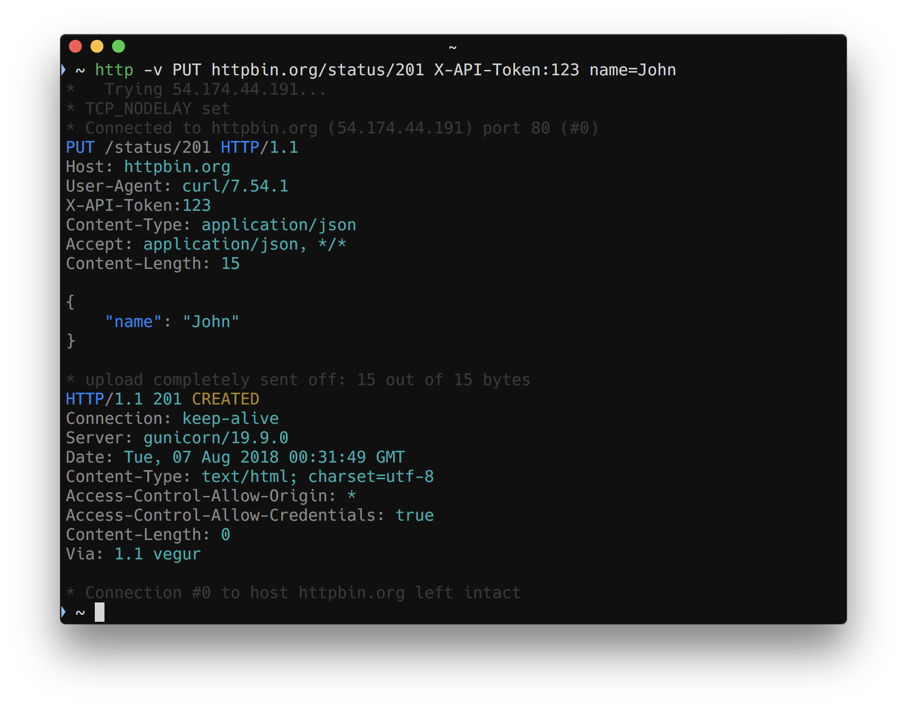

# Curlie

If you like the interface of [HTTPie](https://httpie.org) but miss the features of [curl](https://curl.haxx.se), curlie is what you are searching for. Curlie is a frontend to `curl` that adds the ease of use of `httpie`, without compromising on features and performance. All `curl` options are exposed with syntax sugar and output formatting inspired from `httpie`.

## Install

Using [homebrew](https://brew.sh/):

```
brew install curlie
```

Using [macports](https://www.macports.org):

```
sudo port install curlie
```

Using [pkg](https://man.freebsd.org/pkg/8):

```
pkg install curlie
```

Or download a [binary package](https://github.com/rs/curlie/releases/latest).

## Usage

Synopsis:

    $ curlie [CURL_OPTIONS...] [METHOD] URL [ITEM [ITEM]]

Simple GET:



Custom method, headers and JSON data:



## Build

Build with [goreleaser](https://goreleaser.com) to test that all platforms compile properly.

```bash
goreleaser --snapshot --skip-publish --rm-dist
```

Or with `go build` for your current platform only.

```bash
go build .
```

## Differences with httpie

* Like `curl` but unlike `httpie`, headers are written on `stderr` instead of `stdout`.
* Output is not buffered, all the formatting is done on the fly so you can easily debug streamed data.
* Use the `--curl` option to print executed curl command.

## License

All source code is licensed under the [MIT License](https://raw.github.com/rs/curlie/master/LICENSE).
